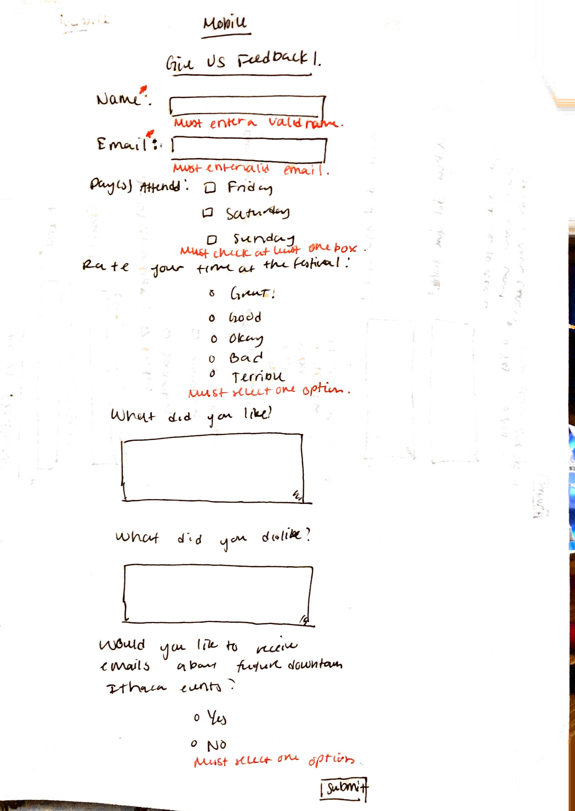

# Project 3 - Design Journey

Be clear and concise in your writing. Bullets points are acceptable.

## Planning, Design, & Evaluation

### Target Audience (Milestone 1)
> Who is your site's target audience? This should be the original target audience from Project 1 or Project 2.

The site's target audience are first-year Cornell students who are attending the Apple Harvest Festival for the first time and are not familiar with the downtown Ithaca area.

### Planning & Designing for User Input (Milestone 1)
> Determine what purpose the form for your site will accomplish, where it will go (physical placement on page and the HTML file name), and what form components you plan on using.

Purpose: The purpose of my form for my site will be to allow first-time visitors to give feedback on the festival and share their comments about the festival as well as opt in to potential further emails about updates on other downtown Ithaca events. 


Location: The form will be located at the bottom of the home page after all of the main content.


Form Components:
  - Name: text field; `<input type="text">`
  - Email: email field; `<input type="email">`
  - Day(s) Attended: checkbox field; `<input type="checkbox">`
  - Rate your time at the festival: radio buttons; `<input type="radio">`
  - What did you like about your experience?: multi-line text field; `<textarea>`
  - What did you dislike about your experience?: multi-line text field; `<textarea>`
  - Would you like to receive emails about future downtown Ithaca events?: radio buttons; `<input type="radio">`
  - Submit: submit button; `<button type="submit">`

> Include sketches on your form below. Include sketches of your **mobile and desktop** versions.

**Desktop Sketches**


**Mobile Sketches**


> What submission method will your form use? GET or POST. Explain your reasoning.

My form will use a POST method because the user should only submit the form once and is not requesting any information from the server.

### Determine the Form Validation Criteria (Milestone 1)
> For each control in your form, specify the validation criteria AND your reasoning behind the criteria.

- Name
  - reasoning: Name is required in order to identify the user that is giving feedback. Valid name would include text and no special characters.
  - required/optional: `required`
  - constraints: N/A
- Email
  - reasoning: Email is required in order to be able to contact the user/have the email of the user to send future emails to for updates.
  - required/optional: `required`
  - constraints: N/A
- Day(s) Attended:
  - reasoning: This field is required to make sure that the user did actually attend the festival and since specific days had different events. Only constraint is that at least one check box must be checked, which is covered in the required attribute.
  - required/optional: `required`
  - constraints: N/A
- Rate your time at the festival:
  - reasoning: This field is required so the feedback is useful to get a general opinion of how the user experience at the festival was.
  - required/optional: `required`
  - constraints: N/A
- What did you like?:
  - reasoning: This field is optional because this input is to allow the user to expand and include specific feedback. Maximum length of 500 characters to ensure brevity.
  - required/optional: optional
  - constraints: `max-length= 500`
- What did you dislike?:
  - reasoning: This field is optional because the user does not need to include things they disliked, and they may even have not disliked anything about the festival. Maximum length of 500 characters ensures brevity.
  - required/optional: optional
  - constraints: `max-length= 500`
- Opt in for emails:
  - reasoning: This field is required because it is a yes or no question and the user must opt in or out of future emails.
  - required/optional: `required`
  - constraints: N/A


### Design Form Feedback (Milestone 1)
> Include sketches of your **mobile and desktop** _feedback_.

**Desktop Feedback**


**Mobile Feedback**


### User Testing Plan (Milestone 1)
> Plan out your **one** task to evaluate your form.

Task: Opt in to receive future emails to learn about downtown Ithaca events using the email user1@gmail.com.


### User 1 - Testing Notes (Milestone 1)
> When conducting user testing, you should take notes during the test. Place your notes here.


### User 1 (Milestone 1)
> Using your notes from above, describe your user 1 by answering the questions below.

1. Who is your user 1, e.g., where user 1 comes from, what is your user 1’s job, characteristics, etc.?
User 1 is a first-year Cornell student studying Mechanical Engineering in the College of Engineering. She is from New Jersey. She enjoys watching Netflix shows during her free time but spends most of her time either in the library or in her dorm doing work. She likes to go out on the weekends, especially to eat food in Collegetown.

2. Does your user 1 belong to your target audience of the site? (**Yes** / No)

> If “No”, what’s your strategy of associating the user test results to your target audience’s needs and wants? How can your re-design choices based on the user tests make a better fit for the target audience?


### User 1 - **Desktop** (Milestone 1)
> Report the results of your user 1 evaluation. You should explain **what the user did**, describe the user's **reaction/feedback** to the design, **reflect on the user's performance**, determine what **re-design choices** you will make. You can also add any additional comments. See the example design journey for an example of what this would look like.

- **Did you evaluate the desktop or mobile design?**
  - Pick one: **desktop**/mobile
- **How did the user do? Did they meet your expectation?**
  - The user correctly filled out the email and chose 'yes' to opt into emails in very little time, which met my expectations.
- **User’s reaction / feedback to the design** (e.g., specific problems or issues found in the tasks)
  - The user thought that the design was easy to follow and suggested that there be an extra field to enter in possible suggestions from the user.
- **Your reflections about the user’s performance to the task**
  - I'm glad that the user was able to easily complete the task, although they did go through the entire form at first as they thought that they would have to complete the entire form, not the singular task.
- **Re-design choices**
  - Add a suggestion multi-line text box to allow users to give suggestions for future Apple festivals.
- **Additional Notes**
  - N/A


### User 2 - Testing Notes (Milestone 1)
> When conducting user testing, you should take notes during the test. Place your notes here.


### User 2 (Milestone 1)
> Using your notes from above, describe your user 2 by answering the questions below.

1. Who is your user 2, e.g., where user 2 comes from, what is your user 2’s job, characteristics, etc.?
My user is a first-year Cornell student studying CS in the College of Engineering. She is from Long Island. She is very interested in photography and visual design as well as environmentalism. Throughout the week, she is usually studying in either the library or her dorm. She likes to go out on the weekends with her friends in Collegetown or stays in to watch a movie with her suite.

2. Does your user 2 belong to your target audience of the site? (**Yes** / No)

> If “No”, what’s your strategy of associating the user test results to your target audience’s needs and wants? How can your re-design choices based on the user tests make a better fit for the target audience?


### User 2 - **Mobile** (Milestone 1)
> Report the results of your user 2 evaluation. You should explain **what the user did**, describe the user's **reaction/feedback** to the design, **reflect on the user's performance**, determine what **re-design choices** you will make. You can also add any additional comments. See the example design journey for an example of what this would look like.

- **Did you evaluate the desktop or mobile design?**
  - Pick one: desktop/**mobile**
- **How did the user do? Did they meet your expectation?**
  - The user quickly filled in the email portion with the correct email and checked yes to opt in to emails, which took the expected 30 seconds.
- **User’s reaction / feedback to the design** (e.g., specific problems or issues found in the tasks)
  - The user did not note any specific issues about the task/form.
- **Your reflections about the user’s performance to the task**
  - I'm glad that the mobile version of the form was easy to follow and the user seemed to be able to easily navigate down the form.
- **Re-design choices**
  - None
- **Additional Notes**
  - N/A


### Design Changes (Milestone 1)
> Use the space provided here to document any design changes from testing.

I decided to add an additional suggestion multi-line text box to the form, which would be optional and like the other two multi-line text boxes, have a maximum character limit of 500 characters.


### Additional Information (Milestone 1)
> (optional) Include any additional information, justifications, or comments we should be aware of.


---

## Polished & Tested Form

###  Plan Validation Pseudocode (Final Submission)
> Write your form validation pseudocode here.

```
  TODO
```

### User Testing Plan (Final Submission)
> This should probably be the same task from your first round of testing unless you have a reason to change it.

Task:


### User 3 - Testing Notes (Final Submission)
> When conducting user testing, you should take notes during the test. Place your notes here.


### User 3 (Final Submission)
> Using your notes from above, describe your user 3 by answering the questions below.

1. Who is your user 3, e.g., where user 3 comes from, what is your user 3’s job, characteristics, etc.?


2. Does your user 3 belong to your target audience of the site? (Yes / No)

> If “No”, what’s your strategy of associating the user test results to your target audience’s needs and wants? How can your re-design choices based on the user tests make a better fit for the target audience?


### User 3 - **Desktop** (Final Submission)
> Report the results of your user 3 evaluation. You should explain **what the user did**, describe the user's **reaction/feedback** to the design, **reflect on the user's performance**, determine what **re-design choices** you will make. You can also add any additional comments. See the example design journey for an example of what this would look like.

- **Did you evaluate the desktop or mobile design?**
  - Pick one: desktop/mobile
- **How did the user do? Did they meet your expectation?**
  - TODO
- **User’s reaction / feedback to the design** (e.g., specific problems or issues found in the tasks)
  - TODO
- **Your reflections about the user’s performance to the task**
  - TODO
- **Re-design choices**
  - TODO
- **Additional Notes**
  - TODO: Justify your decisions; additional notes.


### User 4 - Testing Notes (Final Submission)
> When conducting user testing, you should take notes during the test. Place your notes here.


### User 4 (Final Submission)
> Using your notes from above, describe your user 4 by answering the questions below.

1. Who is your user 4, e.g., where user 4 comes from, what is your user 4’s job, characteristics, etc.?


2. Does your user 4 belong to your target audience of the site? (Yes / No)

> If “No”, what’s your strategy of associating the user test results to your target audience’s needs and wants? How can your re-design choices based on the user tests make a better fit for the target audience?


### User 4 - **Mobile** (Final Submission)
> Report the results of your user 4 evaluation. You should explain **what the user did**, describe the user's **reaction/feedback** to the design, **reflect on the user's performance**, determine what **re-design choices** you will make. You can also add any additional comments. See the example design journey for an example of what this would look like.

- **Did you evaluate the desktop or mobile design?**
  - Pick one: desktop/mobile
- **How did the user do? Did they meet your expectation?**
  - TODO
- **User’s reaction / feedback to the design** (e.g., specific problems or issues found in the tasks)
  - TODO
- **Your reflections about the user’s performance to the task**
  - TODO
- **Re-design choices**
  - TODO
- **Additional Notes**
  - TODO: Justify your decisions; additional notes.


### Design Changes (Final Submission)
> Use the space provided here to document any design changes from testing.


### Additional Design Justifications (Final Submission)
> If you feel like you haven’t fully explained your design choices in the final submission, or you want to explain some functions in your site (e.g., if you feel like you make a special design choice which might not meet the final requirement), you can use the additional design justifications to justify your design choices. Remember, this is place for you to justify your design choices which you haven’t covered in the design journey. Use it wisely. However, you don’t need to fill out this section if you think all design choices have been well explained in the final submission design journey.


### Self-Reflection (Final Submission)
> This was the first project in this class where you coded some JavaScript. What did you learn from this experience?


> Take some time here to reflect on how much you've learned since you started this class. It's often easy to ignore our own progress. Take a moment and think about your accomplishments in this class. Hopefully you'll recognize that you've accomplished a lot and that you should be very proud of those accomplishments!
